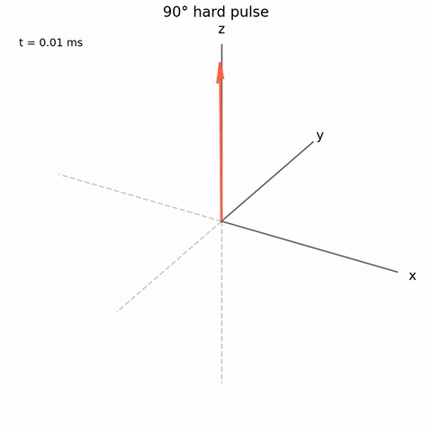
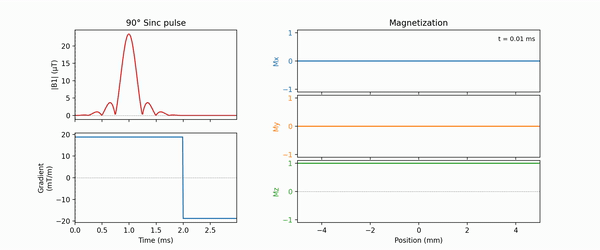
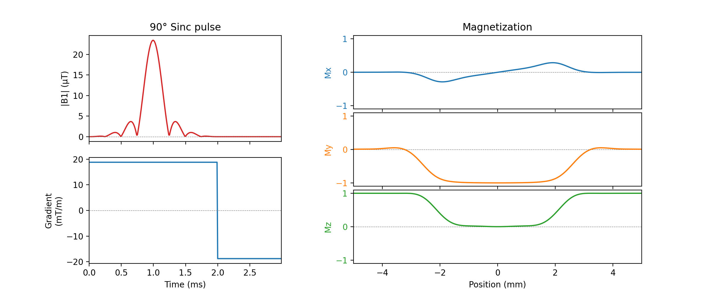

# Bloch Simulator

Simulate MR spin dynamics in Python or MATLAB

<table>
  <tr>
    <td align="left">
      <br>
    </td>
    <td align="right">
      <br>
    </td>
  </tr>
</table>

## Usage

### 90° hard pulse, 1 ms duration, on-resonance

**Python**
```python
import numpy as np
from bloch import bloch

dur    = 1e-3                             # total duration (s)
dt     = 10e-6                            # 10 us per time step
ntime  = int(dur / dt)                    # number of time steps
flip   = np.pi / 2                        # 90° flip angle
b1_amp = flip / (2 * np.pi * ntime * dt)  # B1+ amplitude (Hz)
b1     = b1_amp * np.ones(ntime)          # B1+ waveform
gr     = np.zeros(ntime)                  # gradient waveform (Hz/m)

mx, my, mz = bloch(b1, gr, dt)  # Run the Bloch simulation
# mx=0.0, my=-1.0, mz=0.0 (Mz tipped to -My by 0°-phase RF)
```

**MATLAB**
```matlab
dur    = 1e-3
dt     = 10e-6
ntime  = round(dur / dt)
flip   = pi / 2
b1_amp = flip / (2 * pi * ntime * dt);
b1     = b1_amp * ones(ntime, 1);
gr     = zeros(ntime, 1);

[mx, my, mz] = bloch(b1, gr, dt);
% mx=0.0, my=-1.0, mz=0.0
```

### Simulate spins with different off-resonances and with T1/T2 relaxation

**Python**
```python
df  = np.linspace(-500, 500, 200) # Hz, off-resonance grid
t1  = 1.0 # s
t2  = 0.1 # s

mx, my, mz = bloch(b1, gr, dt, t1=t1, t2=t2, df=df)
# mx, my, mz each have shape (200,) — one value per frequency
```

**MATLAB**
```matlab
df = linspace(-500, 500, 200)'; % Hz
t1 = 1.0; % s
t2 = 0.1; % s

[mx, my, mz] = bloch(b1, gr, dt, t1, t2, df);
% mx, my, mz are 200×1 vectors
```

### Slice-selective sinc pulse

```python
dur    = 2e-3                                          # pulse duration (s)
dt     = 10e-6                                         # 10 us per time step
ntime  = int(dur / dt)                                 # number of time steps
flip   = np.pi / 2                                     # 90° flip angle
slthk  = 5e-3                                          # slice thickness (m)
TBWP   = 8                                             # time-bandwidth product
b1     = np.sinc(np.linspace(-TBWP/2, TBWP/2, ntime))  # normalized sinc pulse
b1    *= flip / (2 * np.pi * np.sum(b1) * dt)          # B1+ waveform (Hz)
gr     = np.ones(ntime) * TBWP / dur / slthk           # gradient waveform (Hz/m)
dp     = np.linspace(-slthk, slthk, 201)               # positions (m)

mx, my, mz = bloch(b1, gr, dt, dp=dp)
```

<p align="left">
  
</p>

---

## Features

- **Complex RF pulses**
- **T1/T2 relaxation**
- **Multiple off-resonances** — vectorised over any number of frequencies `df`.
- **1D/2D/3D positions** — vectorised over 1D, 2D, or 3D positions `dp`.
- **1D/2D/3D velocities** — vectorised over 1D, 2D, or 3D velocities `dv`.
- **Spoiling** — per-timestep flag to zero transverse magnetisation.
- **Custom initial magnetisation** via `mx0`, `my0`, `mz0`.
- **Mode 0 or 1** — return the endpoint only, or the full time course.
- All dimensions are batched simultaneously: a single call sweeps over all combinations of `df × dp × dv`.

---

## Installation

### Python

Requires a C compiler (`gcc` or `clang`).

```bash
git clone https://github.com/JosephGWoods/bloch.git
cd bloch
bash build_python_lib.sh # compiles bloch.c → python/libbloch.*
pip install -e .         # installs the bloch Python package
```

### MATLAB

Requires a MEX-compatible C compiler (`mex -setup C`, if not yet configured).

```matlab
cd /path/to/bloch
build_matlab_mex   % compiles bloch_mex.c + bloch.c → matlab/bloch_mex.mex*
addpath('matlab')
```

---

## API

### Python

```python
mx, my, mz = bloch(b1, gr, tp,
                   t1=inf, t2=inf,
                   df=0.0, dp=0.0, dv=0.0,
                   mode=0,
                   mx0=None, my0=None, mz0=None,
                   spoil=None)
```

### MATLAB

```matlab
[mx, my, mz] = bloch(b1, gr, tp)
[mx, my, mz] = bloch(b1, gr, tp, t1, t2, df, dp, dv)
[mx, my, mz] = bloch(b1, gr, tp, t1, t2, df, dp, dv, mode)
[mx, my, mz] = bloch(b1, gr, tp, t1, t2, df, dp, dv, mode, mx0, my0, mz0)
[mx, my, mz] = bloch(b1, gr, tp, t1, t2, df, dp, dv, mode, mx0, my0, mz0, spoil)
```

Pass `[]` for any optional MATLAB argument to accept its default.

### Parameters

| Parameter | Type | Description | Default |
|-----------|------|-------------|---------|
| `b1` | complex `(T,)` | RF pulse (Hz) | — |
| `gr` | real `(T,)` or `(T,2)` or `(T,3)` | Gradient waveform (Hz/units) | — |
| `tp` | scalar or `(T,)` | Time step duration (s), or monotonically increasing end-times | — |
| `t1` | scalar | T1 relaxation time (s) | `inf` |
| `t2` | scalar | T2 relaxation time (s) | `inf` |
| `df` | `(F,)` | Off-resonance frequencies (Hz) | `0` |
| `dp` | `(P,)` or `(P,2)` or `(P,3)` | Spatial positions (units) | `0` |
| `dv` | `(V,)` or `(V,2)` or `(V,3)` | Velocities (units/s) | `0` |
| `mode` | int | `0` = endpoint only; `1` = full time course | `0` |
| `mx0,my0,mz0` | arrays | Initial magnetisation | `[0, 0, 1]` |
| `spoil` | `(T,)` | Per-step spoil flags (1 = zero Mx/My) | all zeros |

### Output shape

Units of distance can be anything as long as `gr`, `dp`, and `dv` are mutually consistent.

| Condition | Python shape | MATLAB shape |
|-----------|-------------|--------------|
| mode=0, all scalar | `()` | `[1,1]` |
| mode=0, F×P×V | `(V, F, P)` | `[P, F, V]` |
| mode=1, F×P×V | `(V, F, P, T)` | `[T, P, F, V]` |

Singleton dimensions are squeezed in both interfaces.

### Sign convention

A real (x-phase) 90° pulse rotates Mz → −My.
See M. Levitt, *Spin Dynamics: Basics of Nuclear Magnetic Resonance*, p. 250.

---

## Running the unit tests

**Python** (from the repo root):
```bash
pytest tests/
```

**MATLAB** (from the repo root):
```matlab
addpath('matlab')
results = runtests('tests/matlab/testbloch.m')
```

---

## Repository structure

```
bloch/
├── c/
│   ├── bloch.h           # Function declarations
│   └── bloch.c           # Core simulation code
├── examples
│   ├── examples.py       # Python examples
│   └── media/            # Media saved in examples.py
├── matlab/
│   ├── bloch_mex.c       # MEX wrapper
│   └── bloch.m           # MATLAB wrapper
├── python/
│   └── bloch.py          # Python ctypes wrapper
├── tests/
│   ├── test_bloch.m      # Matlab unit tests
│   └── test_bloch.py     # Python unit tests
├── build_python_lib.sh   # Builds python/libbloch.so
└── build_matlab_mex.m    # Builds matlab/bloch_mex.mex*
```

---

## Contributors

- B. Hargreaves - original Bloch simulator (http://mrsrl.stanford.edu/~brian/blochsim/ - no longer active)
- M. Robson - sign of gyromagnetic ratio
- C. Rodgers - Hz units, debug flag, robustness improvements
- W. Clarke - spoiling support
- J.G. Woods - velocity/flow support, Python interface, ongoing maintenance
